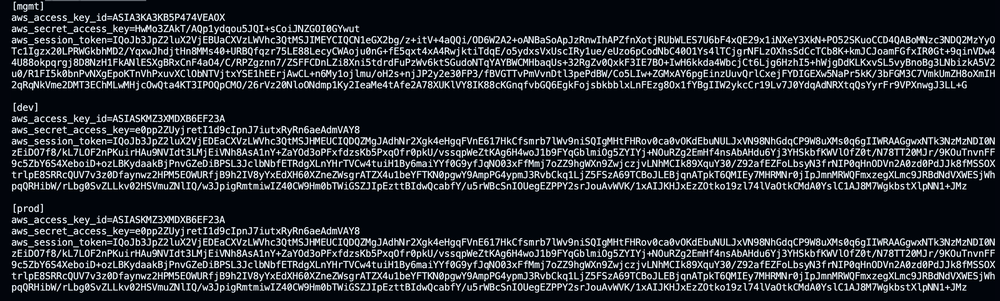

# 🗂️ Terraform File Structure & Resource Organization

This repository uses a **modular approach** to manage infrastructure using Terraform. Resources should be provisioned in the following order:

1. **terraform-backend** – Central Remote state configuration (e.g., S3 + DynamoDB) (Mangement Account)
2. **terraform-network** – Networking components (e.g., VPC, subnets, gateways) (Mangement Account)
3. **terraform-global-resources** – Global resources (e.g., IAM, Route53,ACM certs) (Individual Account)
4. **terraform-infrastructure** – AWS infrastructure (e.g., ECS, RDS, ALB) (Individual Account)
5. **terraform-pipelines** - Codepipeline & Codebuild resources (Individual Account)

---

## ▶️ How to Execute the Modules

- Configure the AWS credentials file (`~/.aws/credentials`) with named profiles that match your workspace names (e.g., `mgmt`).  
  

### 1️⃣ Terraform Backend Setup

**Directory:** `terraform-backend`  
**Purpose:** Creates backend resources such as the S3 bucket and DynamoDB table to store Terraform state.

#### Steps:

1. **Initialize Terraform:**

   ```bash
   terraform init
   ```

        > Considering in the (`~/.aws/credentials`) you have saved profile with [mgmt]

   - This downloads required plugins/modules.
   - Backend config is local at this point, so no `-backend-config` is needed.

2. **Create Workspace:**

   ```bash
   terraform workspace new mgmt
   ```

3. **Plan:**

   ```bash
   terraform plan -var-file='mgmt.tfvars'
   ```

4. **Apply:**

   ```bash
   terraform apply -var-file='mgmt.tfvars'
   ```

   - This creates backend infra and stores the state in S3.

   > This Will be created in mgmt account!

---

### 2️⃣ Create Central VPC

**Directory:** `terraform-network`  
**Purpose:** VPC and networking resources in the management account.

#### Notes:
- In `provider.tf`, uncomment and set the correct profile name from your credentials file.

#### Steps:

1. **Initialize Terraform:**

   ```bash
   terraform init -backend-config="mgmt.s3.tfbackend"
   ```

2. **Create Workspace:**

   ```bash
   terraform workspace new <WORKSPACE_NAME>
   # e.g., dev, uat, prod
   ```

3. **Plan:**

   ```bash
   terraform plan -var-file='tfvars/<WORKSPACE_NAME>_mgmt.tfvars'
   ```

4. **Apply:**

   ```bash
   terraform apply -var-file='tfvars/<WORKSPACE_NAME>_mgmt.tfvars'
   ```


>### Note: If you're creating the infrastructure for the first time, run terraform apply and then encrypt the tfvars file using the KMS key with alias ssm_key_alias & same key can be used to decrypt it.

### How to Encrypt Or Decrypt files with sops
```bash
1. Install sops from [offical Github.](https://github.com/getsops/sops/releases)
2. sops -e --kms KMS_ARN FILE
3. sops -d -i FILE
```

### 3️⃣ Create Global resources

**Directory:** `terraform-global-resources`  
**Purpose:** Route53 Hosted Zone and ACM Certificates & SSM Parameters for ECS Services in the individual account.

#### Notes:
   > **Run this BEFORE `terraform-infrastructure`**  
   > Required for resources like ACM certificates used by ALB.  
   > & SSM Parameters used by ECS Services.

- Decrypt the tfvars file before running the terraform plan or apply
- The tfvars can be decrypted with sops.

#### Steps:

1. **Initialize Terraform:**

   ```bash
   terraform init -backend-config="mgmt.s3.tfbackend"
   ```

2. **Create Workspace:**

   ```bash
   terraform workspace new <WORKSPACE_NAME>
   # e.g., dev, uat, prod
   ```

3. **Decrypt tfvars file:**

   ```bash
   sops -d -i 'tfvars/<WORKSPACE_NAME>.tfvars'
   ```

3. **Plan:**

   ```bash
   terraform plan -var-file='tfvars/<WORKSPACE_NAME>.tfvars'
   ```

4. **Apply:**

   ```bash
   terraform apply -var-file='tfvars/<WORKSPACE_NAME>.tfvars'
   ```

---

### 4️⃣ Create AWS Infrastructure

**Directory:** `terraform-infrastructure`  
**Purpose:** Provisions core resources like ECS, databases, alb, etc. in the individual account

#### Steps:

1. **Initialize:**

   ```bash
   terraform init -backend-config="mgmt.s3.tfbackend"
   ``` 

2. **Create Workspace:**

   ```bash
   terraform workspace new <WORKSPACE_NAME>
   ```

3. **Plan:**

   ```bash
   terraform plan -var-file='tfvars/<WORKSPACE_NAME>.tfvars'
   ```

4. **Apply:**

   ```bash
   terraform apply -var-file='tfvars/<WORKSPACE_NAME>.tfvars'
   ```

---

### 5️⃣ Provision CI/CD Pipelines

Directory: `terraform-pipelines` 

Purpose: This module provisions CI/CD resources such as AWS CodeBuild and CodePipeline within the individual account.

- Instructions:
Follow the same deployment steps used for the [terraform-infrastructure](#4️⃣-create-aws-infrastructure) module to apply this configuration.

---

## 📁 Repo Directory Structure

### `terraform-network`
- Provisions networking resources like VPC, subnets, gateways.
- Uses `network` module from `terraform-modules`.

---

### `terraform-global-resources`
- Secrets Manager & SSM Parameters for ECS
- Route 53 Hosted Zone
- ACM Certificates
- This Module contains resoures that should not be deleted regularly

---

### `terraform-infrastructure`
- Provisions app-specific infra: databases, ECS, load balancers, etc.
- Reuses modules from `terraform-modules`.
- Add new reusable modules if needed.

---

### `terraform-modules`
Reusable infrastructure modules:

- **network** – VPCs, subnets, gateways, etc.
- **s3** – S3 Buckets
- **compute** – ALB, SSL with ACM
- **container** – ECR repos, ECS clusters
- **Aurora-Postgres** – Global cluster (prod) or 2-node (others)
- **ElastiCache-Redis** – Redis with subnet and parameter groups
- **MSK-Kafka** – MSK cluster with KMS, SGs, and CloudWatch logging
- **Cloudwatch-dashboard** – CloudWatch Dashboard shows ECS Services CPU & Memory Utilization & ALB Hits

---
### `terraform-pipeline`
- Provisions AWS CodePipeline and CodeBuild resources

---

### 6️⃣ Steps to Tear Down AWS Infrastructure with Terraform

1. Destroy Application Infrastructure
Begin by destroying the main infrastructure managed in the `terraform-infrastructure` directory:

```bash
   terraform destory -var-file='tfvars/<WORKSPACE_NAME>.tfvars'
```

2. Destroy Global Resources (Optional)
If you also need to delete ACM certificates or the Route 53 Hosted Zone, navigate to the `terraform-global-resources` directory and run:

```bash
   terraform destory -var-file='tfvars/<WORKSPACE_NAME>.tfvars'
```

3. Destroy Networking Resources
Finally, destroy the networking components by running the following in the `terraform-network` directory:

```bash
   terraform destory -var-file='tfvars/<WORKSPACE_NAME>_mgmt.tfvars'
```

4. Destroy Pipeline Resources
Tear down any CI/CD pipeline resources by executing the command in the `terraform-pipelines` directory:

```bash
   terraform destory -var-file='tfvars/<WORKSPACE_NAME>.tfvars'
```

4. Destroy Backend Resources
Finally, destroy the backend resources (such as S3 buckets and DynamoDB tables used for state management) from the `terraform-backend` directory:

```bash
   terraform destory -var-file='mgmt.tfvars'
```
